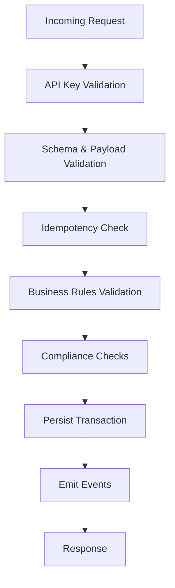
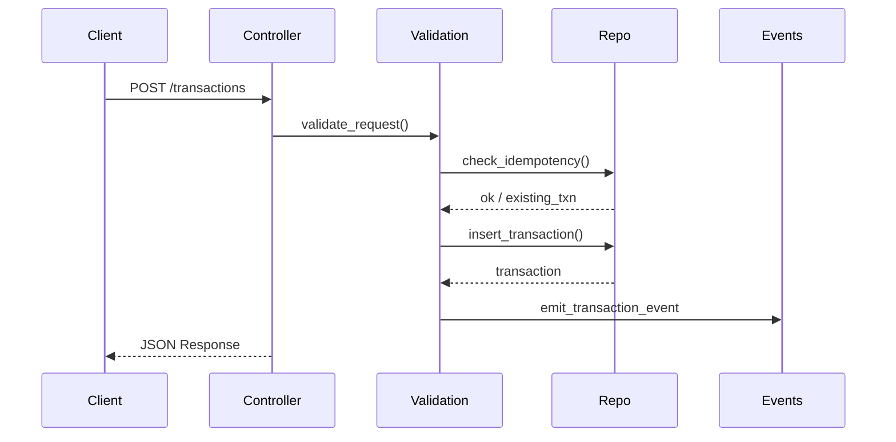

# iSupayX – Transaction Processing API 💳⚡

**iSupayX** is an API-only Phoenix application for processing merchant transactions with **layered validation**, **idempotency guarantees**, and **compliance checks**.

The system is intentionally minimal, explicit, and auditable — designed to resemble a real payment gateway core while remaining easy to reason about and extend.

---

## ✨ Features

- 🔐 API key–based authentication
- 🔁 Idempotent transaction processing
- 🧩 Layered validation pipeline
- 🧾 Persistent transaction records
- 🧠 Clear separation of concerns
- 🗄 SQLite-backed storage via Ecto
- 📦 API-only Phoenix app (no HTML, no LiveView)

---

## 🧱 Tech Stack

| Layer        | Technology |
|-------------|------------|
| Language     | Elixir |
| Web         | Phoenix (API-only) |
| Persistence | Ecto |
| Database    | SQLite |
| JSON        | Jason |

---

## 🚀 Getting Started

### Prerequisites

- Elixir ≥ 1.14
- Erlang/OTP ≥ 25

### Setup

```bash
mix deps.get
mix ecto.create
mix ecto.migrate
mix run priv/repo/seeds.exs
mix phx.server
```

Server will start at:
```
http://localhost:4000
```
##  🔌 API Overview
### Create Transaction
```
POST /api/v1/transactions
```
### Headers
```
Content-Type: application/json
X-Api-Key: <your-api-key>
Idempotency-Key: <optional-unique-key>
```
### Request Body
```
{
  "amount": 5000,
  "currency": "USD",
  "merchant_id": "mrc_123",
  "reference": "order_456"
}
```
### Successful Response
```
{
  "status": "approved",
  "transaction_id": "txn_abc123",
  "amount": 5000,
  "currency": "USD"
}
```
### Idempotent Replay Response

If the same request is sent again with the same Idempotency-Key:
```

{
  "status": "approved",
  "transaction_id": "txn_abc123",
  "idempotent": true
}
```
## 🔁 Idempotency Behavior

- Idempotency is enforced per API key

- The request payload is hashed and stored

- Replays return the original response

- Conflicting payloads with the same key are rejected

 ## 🧩 Validation Pipeline

Transaction processing is handled through a layered validation pipeline.




Each validation layer:

- Is isolated

- Has a single responsibility

- Can fail fast with meaningful errors

## 🧠 Architecture Overview


## Project Structure
```
lib/
├── isupayx/
│   ├── schemas/        # Ecto schemas (transactions, keys, etc.)
│   ├── validation/     # Validation & business logic layers
│   └── events/         # Domain events
│
├── isupayx_web/
│   └── controllers/    # API controllers
│
priv/
├── repo/
│   └── migrations/     # Database migrations
│
test/
├── isupayx_web/
│   └── controllers/    # Controller tests
```


## 🧪 Testing

Run the test suite with:
```
mix test
```

## Tests focus on:

- Validation failures
- Idempotency guarantees
- API contract correctness
---
## 📓 Design Notes

Architecture decisions, tradeoffs, and assumptions are documented in:
```
decision_log.md
```

This includes:

- Why SQLite was chosen

- Validation strategy

- Event handling approach

- Idempotency storage model
---
## 🔮 Future Enhancements

- Webhook delivery

- Async processing via Oban

- Fraud scoring module

- Rate limiting

- Multi-currency settlement logic
---
## 🧑‍💻 Author

Built with ❤️ using Elixir & Phoenix.
